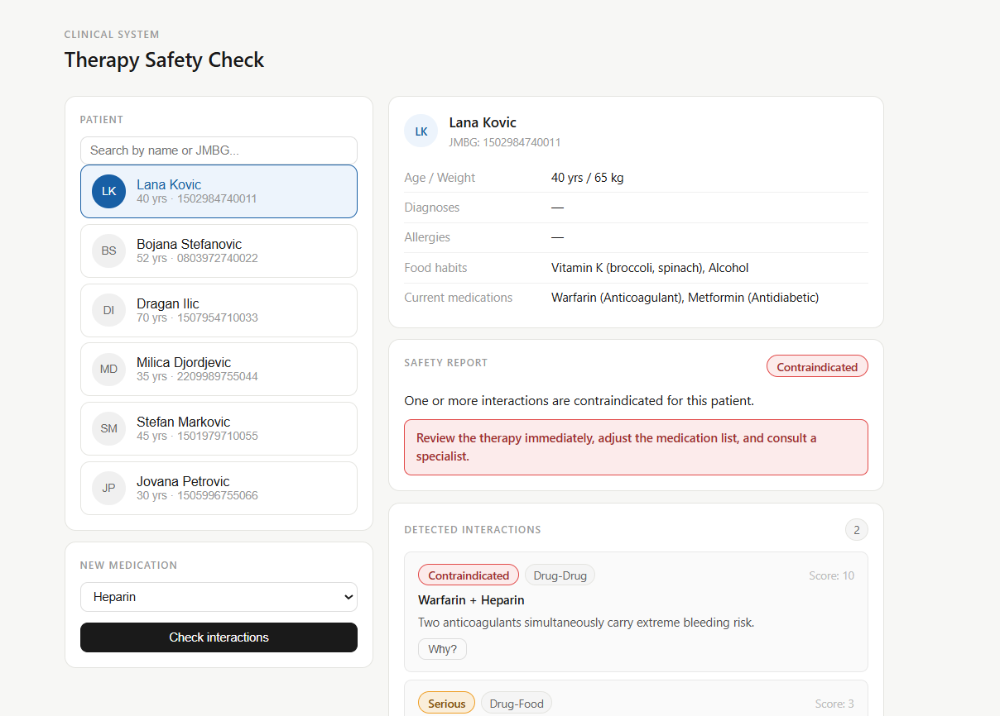

# Drug Interaction Checker

A rule-based clinical decision support system for detecting harmful drug interactions. The system reasons over drug-drug, drug-disease, and drug-food interactions using a knowledge base built from pharmaceutical literature, taking into account the full patient profile (age, diagnoses, current medications, dietary habits).

## 

## Tech Stack

| Layer                      | Technology                                        |
| -------------------------- | ------------------------------------------------- |
| Knowledge base & reasoning | Drools (rule engine, forward + backward chaining) |
| Backend service            | Spring Boot (Java)                                |
| Frontend                   | React + Vite                                      |

---

## How It Works

The system applies three levels of forward chaining:

1. **Interaction detection**, rules fire based on the patient's current medications, diagnoses, and dietary habits against the new drug being checked. Each detected interaction is classified as `MILD`, `SERIOUS`, or `CONTRAINDICATED` with a numeric weight (1 / 3 / 10).
2. **Risk aggregation**, an `accumulate` rule sums the total risk score. If it exceeds a threshold, a `HighRiskTherapy` fact is inserted.
3. **Report generation**, the final safety report with a concrete recommendation is generated based on the aggregated risk and patient profile.

The system uses **backward chaining** for severity explanation. It reconstructs the full causal chain from a factor (e.g. grapefruit) through physiological mechanisms to the final risk classification (e.g. grapefruit → CYP3A4 inhibition → reduced drug metabolism → drug accumulation → SERIOUS).

Severity can also be **escalated** by patient profile rules, for example: a SERIOUS interaction involving a renally-excreted drug in a patient over 65 becomes CONTRAINDICATED.

---

## Project Structure

```
drug-interaction-checker/
├── model/          # Shared domain model (Maven)
├── kjar/           # Drools knowledge base = rules, queries, templates (Maven)
└── service/        # Spring Boot backend (Maven)

frontend/           # React + Vite frontend
```

---

## Prerequisites

- Java 17+
- Maven
- Node.js 18+

---

## Running the Application

### 1. Build the shared model

```bash
cd model
mvn clean install
```

### 2. Build the knowledge base (kjar)

```bash
cd kjar
mvn clean install
```

### 3. Build and run the backend service

```bash
cd service
mvn clean package
mvn spring-boot:run
```

The backend will start on **http://localhost:8090**.

### 4. Run the frontend

```bash
cd frontend
npm install
npm run dev
```

The frontend will be available at **http://localhost:5173** (or the port shown in the terminal).

---

## Features

- Patient search by name or ID
- New medication selection and interaction check
- Safety report with total risk score and recommended action
- Detected interactions listed with severity badge, interaction type, and reason
- Causal chain explanation for each interaction factor (backward chaining)
- Severity escalation based on patient age, polypharmacy, and high-risk diagnoses
